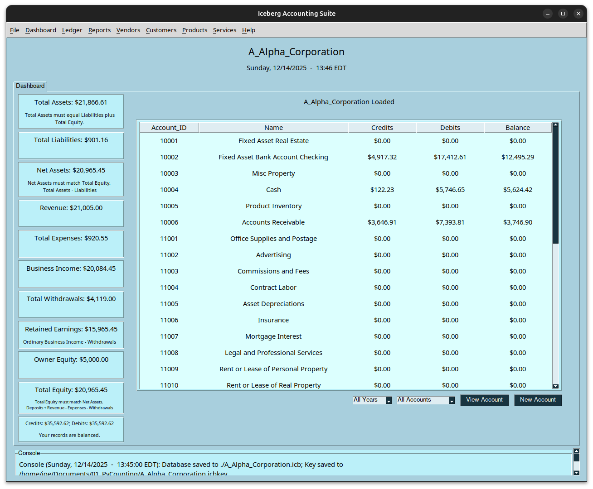
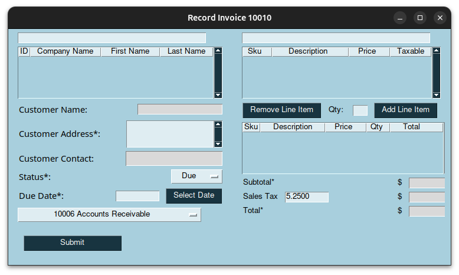
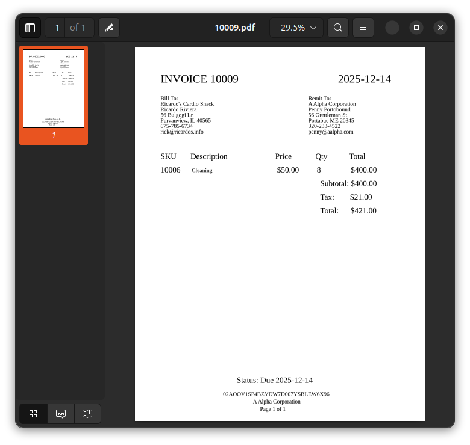

# Iceberg Accounting Suite
Welcome to Iceberg Accouting Suite! This software will provide you with a set of accounting books and now includes invoicing. The purpose of this software is to help individuals and small businesses keep track of their financial records in one place. 

### Running From Code (Linux):
Running this program from code requires Python 3. Please follow the installation instructions here: https://www.python.org/downloads/

Once you have Python 3 installed, open a terminal and navigate to the Iceberg folder. Enter the following commands to create a virtual environment and run from code:

1. Create a virtual environment in the folder in a hidden subfolder called ".venv".
   
    > python3 -m venv .venv

2. Activate the virtual environment in the terminal:
   
    > source .venv/bin/activate

3. Install all prerequisites in the virtual environment you created:
    > pip install -r requirements.txt

4. Launch Iceberg:
    > python3 iceberg.py

The Graphical User Interface (GUI) will pop up showing the Dashboard.

Subsequent startups:

1. Open a terminal and navigate to the Iceberg folder.
   
2. Activate the virtual environment:

    > source .venv/bin/activate

3. Launch Iceberg:

    > python3 iceberg.py

### Accounting Databases
#### Creating a Database
Once the program has opened, the first step is to create a database from the File>New Database dropdown in the top menu. 

   > In the popup, enter a business name. You can use your own name if you aren't a business.

   > Select a filekey save location. This can be anywhere, including a thumb drive. The filekey is the file you will select when opening your database.

   > Enter your business address

   > Fill out identifying information and notes (optional)

   > If you collect sales tax, fill out your state's sales tax percentage. If you don't collect sales tax, leave the field set to 0.00.

   > Select a receipts repository location. It is recommended that you organize your receipts into sub-folders by year. Invoices will also be saved to this folder.

   > Hit Submit. The database (.icb) will be created in the Iceberg folder and the chart of accounts will load to the dashboard in the main window.

#### Saving a database
The database is loaded into your RAM while it is being edited. It is necesarry to save the database file to prevent losing information on exit.   

   > The database will autosave every 5 minutes while it is open. 
    
   > You can also select File>Save Database from the top menu.

#### Opening a Database
On subsequent startups, you can open your database by selecting File>Open Database from the top menu. 

   > In the popup, select your filekey (.icbkey). This is the file that you saved when creating the database.

   > The software will use your filekey to open the corresponding .icb file in the Iceberg directory. The chart of accounts and financial summary will load to the Dashboard.

#### Viewing and Editing Databse Properties
If you make a mistake when creating your database, you can update the database properties by selecting File>Database Properties in the top menu.

   > The properties will appear in editedable fields. Make changes and then select the Save Properties button. 

### Dashboard

#### Viewing the Chart of Accounts
You can view your chart of accounts on the Dashboard tab by selecting Dashboard>Go to Dashboard from the top menu. The chart of accounts will populate in the panel on the right.

   > Select a specfic year from the year dropdown below the chart of accounts.

   > Select an account type to display from the account type dropdown below the chart of the accounts. 

   > View the register for an account by selecting it in the list and then hitting the View Account button.

The chart of accounts will report all financial history up to the end of the selected year for permanent accounts (assets, liabilities, and equity deposits) while for temporary accounts (expenses, equity withdrawlas, and revenue) only the selected year is reported.

#### Adding an Account
You can add an account on the Dashboard tab by selecting Dashboard>Go to Dashboard from the top menu and hitting the New Account button below the chart of accounts.

   > In the popup, enter an Account Name in the top field.

   > Select the account type from the dropdown menu. 

   > Fill out the bank account information corresponding to this account and add notes (optional).

   > Select the Submit button. The new account will appear in the chart of accounts on the main window.

#### Financial report
You can view your financial report on the Dashboard tab by selecting Dashboard>Go to Dashboard from the top menu.  The finanicial report on the left side of the dashboard reports all financial history in the ledger, regardless of what you display on the chart of accounts. 

### Transactions
#### Creating a Transaction

A journal transaction can be created from the Ledger>View Ledger tab and selecting the New Transaction button or by selecting Ledger>New Transaction directly from the top menu.

   > In the popup, record a transaction name and amount.

   > Select the transaction date using the Select Date button.

   > Select the Debit (Deposit) and Credit (Source) accounts from the drop-down menu. They cannot be the same account.

   > Select a vendor and add notes. (optional)

   > Attach a receipt photo by selecting Select Image. (optional)

   > Hit the submit button. If you filled out everything correctly the button will change to ask Really? Click the button again the save the transaction to the datebase. The transaction will appear at the top of the ledger in the main window.

#### Editing a Transaction
If you make a mistake while entering a transaction, you can edit it from the Ledger tab by selecting Ledger>View Ledger in the top menu.

   > Find the transaction in the ledger using the search bar and year picker.

   > Select the transaction in the list to load its details into the side panel.

   > Select Edit Transaction to unlock the fields.

   > After you've made corrections, select Save Transaction.

### Vendors
#### Adding a Vendor
A vendor can be added from the Vendors>View Vendors tab and selecting the New Vendor button or by selecting Vendors>New Vendor directly from the top menu.

   > In the popup, record a vendor name.

   > Fill out the rest of the fields if you have that information.

   > Select Add Vendor. The vendor will appear in the vendor list in the main window.

#### Editing a Vendor
If you make a mistake while entering a vendor, you can edit it from the Vendor tab by selecting Vendors>View Vendors in the top menu.

   > Find the vendor in the vendor tab using the search bar.

   > Select the vendor in the list to load its details into the side panel.

   > Select Edit Vendor to unlock the fields.

   > After you've made corrections, select Save Vendor.

### Customers
#### Adding a Customer
A customer can be added from the Customers>View Customers tab and selecting the New Customer button or by selecting Customers>New Customer directly from the top menu.

   > In the popup, record a customer address.

   > Fill out the rest of the fields if you have that information. This information will be used on Invoices so the more you have the better.

   > Select Add Customer. The customer will appear in the customer list in the main window.

#### Editing a Customer
If you make a mistake while entering a customer, you can edit it from the Customer tab by selecting Customers>View Customers in the top menu.

   > Find the customer in the customer tab using the search bar.

   > Select the customer in the list to load its details into the side panel.

   > Select Edit Customer to unlock the fields.

   > After you've made corrections, select Save Customer.

### Services
#### Adding a Service
A service can be added from the Services>View Services tab and selecting the New Service button or by selecting Services>New Service directly from the top menu.

   > In the popup, record a brief description and price.

   > Select the taxability of the service from the taxable dropdown. 

   > Add notes if you have any.

   > Select Add Service. The service will appear in the service list in the main window.

#### Editing a Service
If you make a mistake while entering a service, you can edit it from the Service tab by selecting Services>View Services in the top menu.

   > Find the service in the service tab using the search bar.

   > Select the service in the list to load its details into the side panel.

   > Select Edit SKU to unlock the fields.

   > After you've made corrections, select Save SKU.

### Invoices
#### Creating an Invoice

You can generate invoices in pdf format using this software in order to sell your services. In order to create an Invoice, you need to add at least 1 Customer and at least 1 Service to the database following the instructions earlier in this document. You can create an invoice from the Point of Sale tab by selecting Customers>Point of Sale from the top menu and then selecting the New Invoice Button.

   > In the popup, search for your customer using the search bar in the top left. Once you've found them, select them from the list. Their details will populate the form.

   > The default status is set to Due. You can change it to Overdue or Paid in the dropdown. If you select Paid, be sure to select the deposit account from the account dropdown. 

   > Select a due date.

   > Search for services using the top right search bar. Once you have found the service you provided, select it.
    
   > Enter a numeric quantity in the Qty field.

   > Hit the Add Line Item button to add it to the invoice. Build additional line items the same way.

   > If you make a mistake, you can remove a line item by selecting it in the line item list and hitting the Remove Line Item button.

   > You can have up to 10 line items per invoice.

   > Select the Submit button. If everthing is filled out correctly the button will ask Really? Hit the button again to submit your invoice.

   > The printable invoice will open in your computer's primary pdf reader and its details will appear at the top of the invoice list in the main window.

The printable invoice is saved in the Invoices folder inside your Receipts folder. 

#### Reviewing Invoice Transactions
Iceberg automatically creates transactions to track the income you receive from invoices. You can review these transactions from the Ledger tab by selecting Ledger>View Ledger from the top menu.

   > Filter the transaction list by entering "Invoice #####" in the search bar where ##### is your invoice number.

   > Select a transaction from the list to view its details. 

The transactions created by the invoicing system depend on several specific accounts. This includes account 10006 Accounts Receivable, 13003 Sales Tax Payable, and 15001 Sales. These accounts should not be replaced in your chart of accounts. 

